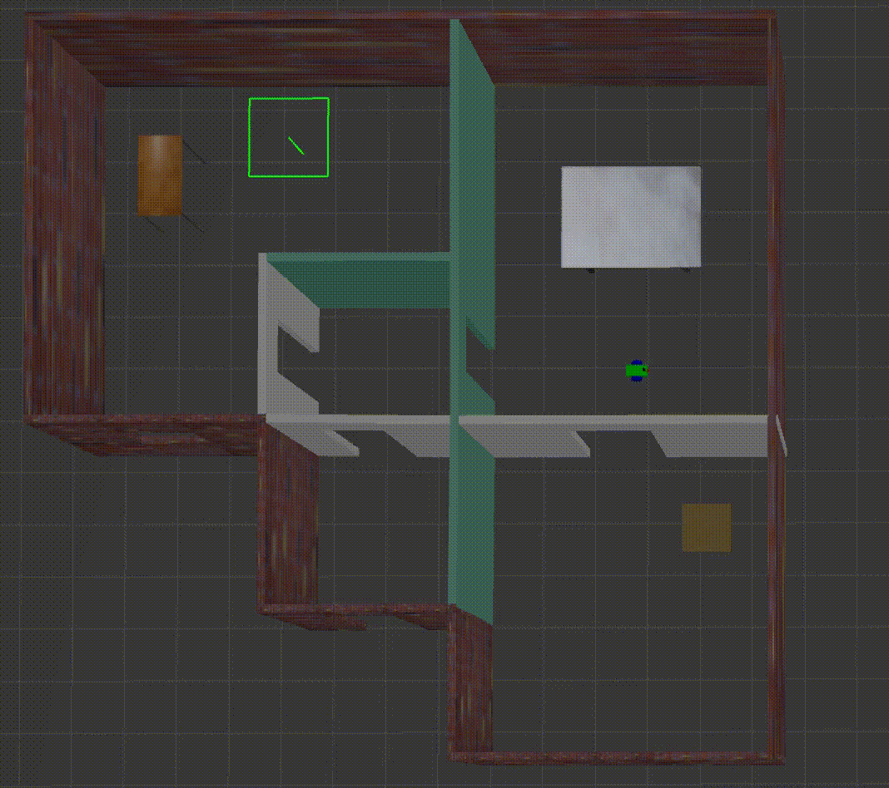

# Udacity Robotics Nanodegree
# Project #3: Where Am I
  


## Introduction
This project involves using a robot mounted with a laser scanner and Monte Carlo Localization to localize the mobile robot in a simulated environment.

## Structure
There are three packages within this repository:

### 1. my_robot
This package defines the mobile robot under URDF as well the world that it is housed within.

### 2. pgm_map_creator
This package converts a .world file into a .pgm grayscale map file.

### 3. teleop_twist_keyboard
This package allows the user to control the mobile robot using a keyboard.

## Setup
First, install Gazebo and ROS on Linux.

Then, install the following ROS packages:
```console
$ sudo apt-get update && sudo apt-get upgrade -y
$ sudo apt-get install ros-kinetic-navigation ros-kinetic-map-server ros-kinetic-move-base ros-kinetic-amcl libignition-math2-dev protobuf-compiler
```

Clone the repository, build it, and then execute and run the mobile robot within the simulated environment:
```console
$ catkin_make
$ source devel/setup.bash
$ roslaunch my_robot world.launch
```

Next, in another terminal, navigate to the root level directory and launch the secondary launch file to start the Monte Carlo Localization:
```console
$ source devel/setup.bash
$ roslaunch my_robot world.launch
```

This will initialize all the nodes. In Rviz, you should see a red robot on a black and white map, surrounded by red arrows representing the particles associated with the AMCL filter.

You can then command the robot to move in Rviz by pressing the "2D Nav Goal" button at the top, and clicking/dragging on the map. The robot will move the position you click, and the arrows will condense around the robot, indicating the filter's best guess as to the position of the robot (and the associated uncertainty).

To operate the robot via the keyboard, open a third terminal, navigate to the root level directory, and execute:
```console
$ source devel/setup.bash
$ rosrun teleop_twist_keyboard teleop_twist_keyboard.py
```

You can then command the robot to move using the keys indicated by the teleop node.
